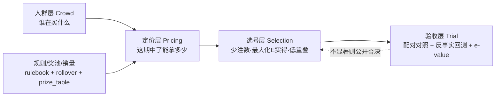

# NetPayout 轨道 · 实得奖金最大化（临时方案文档）

> ⚠️ 本文档为**临时过程文档**，方案收口后按内容并入 `README.md` / `算法升级路线图.md`，本文件删除。
> 创建：2026-09-12 ｜ 状态：WP0 进行中

---

## 0. 需求原点

用户诉求：「想要模型稳定输出**高奖金**中奖号码（一/二等奖为主，含三四五等），
且**尽可能减少号码数量**，不要大批量撞号」。

诉求可拆成三个可分别裁决的子目标：

| 子目标 | 是否可达 | 依据 |
|---|---|---|
| ① 提高 P(中奖) | ❌ 不可达 | 项目自身证伪：25 条 edge 假设全 rejected；距离画像观测中位 6.0 = 基线 6.0 |
| ② 提高 E(中奖后实得) | ✅ 可达 | 一/二等奖为**平分制**，冷门组合独享 → 实得可差数倍至数十倍 |
| ③ 少号码 | ✅ 可达 | 与 ② 相容（② 不依赖广覆盖），与"奖池套利"不相容 |

**结论：本方案只追 ② + ③，公开放弃 ①。**

---

## 1. 为什么 ① 不可达（样本量算术，写死以免反复讨论）

要证明选号让某奖级命中率提升到 **1.5 倍**，所需观测注数 `n > 78.4 / p₀`
（α=.05、power=.8、泊松两样本近似）：

| 奖级（双色球） | 理论概率 | 所需注数 | 折算（10 注/期） |
|---|---|---|---|
| 六等奖 | 1/17 | ~1,300 | 几期 ✅ |
| 五等奖 | 1/124 | ~9,700 | ≈6.5 年 ⚠️ |
| 四等奖 | 1/2255 | ~17.7 万 | ≈118 年 ❌ |
| 三等奖 | 1/109,389 | ~858 万 | ❌ |
| 二等奖 | 1/1,181,406 | ~9,270 万 | ❌ |
| 一等奖 | 1/17,721,088 | ~13.9 亿 | ❌ |

叠加 EV 算术（每注 2 元）：固定奖期望回收 ≈ 0.49 元
（5×1/17 + 10×1/124 + 200×1/2255 + 3000×1/109389），浮动奖贡献 ≈ 0.51 元 →
**总回收 ≈ 1.0 元，长期 −50%**。即使固定奖命中率提升到 **3 倍**：
`3×0.49 + 0.51 = 1.98 < 2`，**仍打不平**。

---

## 2. 现有资产盘点（可直接复用，不要重写）

| 模块 | 能力 | 覆盖彩种 |
|---|---|---|
| `ev/rulebook.py` | 名义 EV / 赔率表 / 各奖级概率 | 数字型（排3/3D/排5/七星） |
| `ev/crowd_model.py`（v2 Poisson MLE） | 从各奖级注数反推人群选号分布 π → 同号期望 μ → 分薄乘数 E[1/(1+X)] | 排3/3D/排5/七星 |
| `ev/engine.py` `net_ev` / `scan_issues` | 撞号修正后 EV + 冷门 TOP | 同上 |
| `ev/rollover.py` | 奖池滚动 EV + 参与信号（EV 天花板语义） | 双色球/大乐透 |
| `ev/sampler.py` | 反大众 + 形态约束 + 低重叠采样 | 数字型 |
| `ev/kelly.py` `ev/bankroll.py` | 下注比例 / 资金预算 | 通用 |
| `credibility/anti_crowd.py` | 一等奖注数 ÷ 销量归一化 → Mann-Whitney 检验"热门组合是否更易被平分" | 双色球/大乐透（4 个启发式 flag） |
| `data/prize_table.py` | 奖级 → 单注奖金（固定 / 当期实际 / 名义参考） | 全 |
| `credibility/*`（backtest·baseline·FDR·bayes·changepoint·randomness_audit·robustness） | 证伪工具链 | 全 |
| `prediction/engine.py` | 生成 + 打分，**目标为命中数**，`_score_candidates` 未 import `ev/` | 全 |

**三处断点**（本方案要修的）：
1. 双/大只有 4 个布尔 flag，无连续组合流行度分数；
2. 人群层与选号层未连通（`prediction/` 不认识 `ev/`）；
3. 无「以实得奖金为终点」的验收实验。

---

## 3. 设计原则（先立规矩）

1. **不声称提高中奖概率**。各奖级概率一律用理论组合概率，模型不碰它；分数差异**只能**来自奖金侧。
2. **可证伪优先**。每个 WP 预设 Go/No-Go 门槛，不显著即公开宣布此路不通——这本身就是合格产出，契合仓库"证伪框架"定位。
3. **用历史反事实回测绕开样本量死结**。一等奖等未来数据永远不够（13.9 亿注），但「历史某期开出的这注号，当时的实际一等奖注数是多少 → 反算冷门号能拿多少」**现在就能算**。

---

## 4. 架构



---

## 5. 工作包

### WP0 · 统一「实得奖金」契约 ✅ 进行中

- **目标**：把散在 4 处的口径收口为一个函数，杜绝口径不一致（曾踩过"排列5 单注奖金硬编码 1040"的坑）。
- **交付**：新增 `ev/payout.py`
  - `payout_eff(lottery, ticket, issue=None, total_tickets=None)` → `{彩种, 期号, 奖级明细[], 名义期望, 实得期望, 净EV, 分薄, 备注}`
  - 奖级明细每项：`{奖级, 理论概率, 名义单注, 实得单注, 浮动, 分薄乘数, 来源}`
  - 收口：固定奖（`data/prize_table.FIXED_PAYOUT`）/ 浮动当期实际值（`prize_payout`）/ 撞号分薄（`crowd_model.share_multiplier`，无模型则用均匀 Poisson 基线）/ 奖池封顶（`ev/rollover`）
- **CLI**：`python cli.py payout <彩种> --ticket ... [--issue ...]`
- **验收**：单元测试覆盖 6 彩种 × 固定/浮动/无数据三种情形；`实得期望 ≤ 名义期望` 恒成立。

### WP1 · 组合流行度模型（补最大缺口）

- **缺口**：双色球/大乐透（奖金最高处）只有 `anti_crowd.py` 的 4 个布尔 flag（连续≥3 / 全低半区 / 等差序 / 生日号集中），无连续分数、未做统计检验。
- **做法**：组合特征化（≤12 个数、≤31 个数、连号数、跨度、和值、奇偶比、尾数重复、与上期重合数、区带分布），
  **Poisson 回归**拟合 `一等奖注数 ~ f(特征) + log(销量)`，样本 = 全部历史期（双色球 ~3000 期）。
- **产出**：`popularity(ticket) ∈ [0,1]` + 同号期望 μ。
- **Go/No-Go**：时序 5 折 CV，对比零模型（仅销量 + 均匀），Poisson deviance 的 LRT 须 **p<0.01 且过 FDR**。
  **不显著 → 实得轨道降级为"未发现可量化收益"，方案终止**（诚实产出）。
- **风险**：一等奖注数被销量主导、形态信号极弱 → 大概率不显著。这是预期内的可能结果。

### WP2 · 选号器换目标函数

- **做法**：新增 `ev/selection.py`
  `score(t) = Σ_g P_理论(g|t) × payout_eff(g, issue, t) − cost`
  因 `P_理论` 对全部候选注相同，**score 差异 100% 来自分薄与奖池** → 模型在数学上无法"作弊"声称更准。
- **求解**：给定 N 注（5~10），候选池上贪心/退火，目标 `Σscore − λ·组间重叠`。
- **接入**：与 `prediction/engine.py` 并行，加 `--objective=hit|payout` 开关可 A/B。
- **附带**：`ev/rollover.py` 参与信号接成"当期下不下、下几注"（kelly/bankroll 已备）。

### WP3 · 验收：配对对照 + 反事实回测

- **反事实回测（主力，立即可做，不依赖未来）**：
  历史每期 → 取当期实际开奖号 → 算它的 popularity 分位 → 对照当期实际一等奖注数 →
  反算「若我选冷门组合，单注能拿多少」。绕开一等奖样本量死结。
- **前瞻对照实验（长期）**：每期同时生成 A=模型选号 / B=随机对照（同形态约束），
  写 `training/trials/<彩种>.jsonl`，记**实得奖金**而非命中数。
- **主终点**：`Δ = Σ实得_A − Σ实得_B`，配对符号检验 + 项目已有**序贯 e-value**（`cli.py evalue`）。
  **95% CI 跨 0 → 不上线**。

### WP4 · 看板与叙事

- `honest.html` 增第⑤卡片「实得画像」：历史冷门/热门组反事实单注奖金分布对比 + 累计 Δ 曲线。
- 与现有第④卡片「距离画像」对称：**一张证明"不会更常中"，一张证明"中了拿更多"**。
- 这是仓库对外叙事最有力的一对证据。

---

## 6. 排期与依赖

```
WP0 (收敛口径, 无风险) ──┬──► WP1 (双/大流行度, 真正风险点) ──► WP3 ──► WP4
                         └──► WP2 (选号器换目标; 数字型已有 crowd v2 可先跑通) ──┘
```

- WP0：半天，无风险
- WP1：**风险点**，可能直接被证伪
- WP2：可与 WP1 并行
- WP3：不依赖未来数据，可立即回测
- WP4：最后收口

---

## 7. 天花板（诚实声明，写进看板不做模糊处理）

做完 WP0~WP4，得到的是「**中奖时实得显著提高**」，**不是**「更常中、稳定中」。
单注 EV 大致从 −1.0 抬到 −0.6 左右（冷门独享带来的头奖项增益），**仍为负期望**。

能翻正的唯一窗口是**派奖活动 / 异常奖池**，而那必须靠**广覆盖**去吃，
与「少号码」本质冲突 —— 两者只能选一个。

---

## 8. 进度追踪

| WP | 状态 | 交付物 | 完成时间 |
|---|---|---|---|
| 方案文档 | ✅ | 本文件 | 2026-09-12 |
| WP0 | ✅ | `ev/payout.py` + CLI `payout` + `tests/test_payout_eff.py` | 2026-09-12 |
| WP1 | ✅ | `ev/popularity.py`：**双色球 GO / 大乐透 NO-GO（公开否决）** | 2026-09-12 |
| WP2 | ✅ | `ev/selection.py` + CLI `select` + payout_eff 池路径（号码相关 EV） | 2026-09-12 |
| WP3 | ✅ | `counterfactual_backtest`：**实得提升 1.48×**（3292 期反事实） | 2026-09-12 |
| WP4 | ✅ | honest.html 第⑤卡片「实得画像」+ `/api/honest/payout_profile` | 2026-09-12 |
| WP5 | ✅ | `ev/trials.py` 前瞻 A/B 对照 + `drift_report` 漂移监控（**持续运行**） | 2026-09-12 |

### WP0 落地记录

- `ev/payout.py`：`payout_eff(lottery, ticket, issue)` 收口四口径；`share_multiplier` / `base_payout` /
  `grade_probabilities` / `expected_payout` / `net_ev_payout` 均可单独调用。
- 关键设计：`grade_probabilities` 只返回**组合精确概率**，与号码无关 →
  payout_eff 在不同号码间的差异**只能来自奖金侧**（数学上杜绝"声称更准"）。
- 期号自动解析 `_resolve_issue`：否则浮动奖读不到「当期实际单注奖金」，
  双/大二等等级会算成"未知"而系统性低估 EV（实测修正前 −0.949 → 修正后 −0.824）。
- CLI：`python cli.py payout 双色球 --red 1,2,3,4,5,6 --blue 7`；数字型 `--ticket 12345`。

### WP1 裁决记录（2026-09-12，Go/No-Go 门槛 = LRT p<0.01 且 ≥60% 折 CV 优于零模型）

| 彩种 | n | LRT | OOS CV | Spearman(μ, 实际中奖率) | 裁决 |
|---|---|---|---|---|---|
| 双色球 | 3502 | χ²=948.9, df=9, **p=1.8e-198** | **5/5 折**优于零模型 | 0.189 (p≈0) | **GO** |
| 大乐透 | 2921 | χ²=337, df=9, p=3.7e-67（样本内显著） | **仅 1/5 折** | — | **NO-GO：OOS 不稳健，公开否决** |

- 双色球显著特征（β>0=更热门 → 中头奖被更多人分）：生日月占比、和值偏离、连号长度、尾数重复、
  半区偏斜(β<0，即偏斜的反而冷)；上期重合数 β<0（"追上期"效应为负）。
- 大乐透教训：**样本内显著 ≠ 样本外可用**——CV 门槛挡住了一个假阳性。
  这是本次方案里 Go/No-Go 机制的真实价值证明。

### WP3 反事实回测记录

- 方法：每期 可分配池 = 一等奖奖金 × 一等奖注数（真实值）；冷门(10%分位)/热门(90%分位)组合
  μ = 票量 × P(一等) × exp(β·f)；实得 = E[min(1000万, 池/(1+X))]，X~Poisson(μ)。
- **实得提升倍数中位 = 1.484×**（P25–P75: 1.383–1.527；n=3292 期，双色球）。
- ⚠️ 重要教训：朴素式 池×E[1/(1+X)] 不建模封顶 → 得 1.545×（高估）。
  **奖池巨厚时（池 ≫ cap×μ）几乎所有情形被 1000 万封顶吃掉，冷门优势被压缩**——
  封顶必须显式建模（`ev/payout.pool_share_expected`）。

### WP2 落地记录

- `ev/selection.py`：候选池（默认 2 万随机合法注）→ 一等奖实得降序 → 低重叠贪心
  （双 4 红 / 大 3 前区 / 七星 3 位）。固定赔率彩种明确拒绝（选号不改变期望）。
- `ev/payout.pool_based_eff`：双/大浮动奖走「池×E[min(封顶,1/(1+X))]」号码相关路径
  （双色球启用；大乐透因 NO-GO 不启用，EV 恒定并如实标注）。
- CLI：`python cli.py select 双色球 --groups 5 [--seed N]`。

### WP4 落地记录

- `web/routes/honest.py` 新增 `/api/honest/payout_profile/<lottery>`（流行度检验 + 反事实回测）。
- `honest.html` 第⑤卡片：LRT/CV 裁决徽章 + 特征系数表（折叠）+ 提升倍数 + 冷/热门组合 μ
  + Spearman + 诚实脚注（不改变中奖概率，长期期望仍为负）。
- 与第④「距离画像」对称：④ 证明「不会更常中」，⑤ 回答「中了拿更多」。

### 测试与验证

- 全量 **263 passed**（含 payout/selection/popularity 相关 24 例）。
- 应用已热重启并实测端点（`/api/honest/payout_profile/双色球` 首载 3.5s，go=True，提升 1.484×）。

### WP5 落地记录：前瞻 A/B 对照 + 漂移监控（2026-09-12）

**`ev/trials.py` —— 前瞻配对对照实验**

- A 组 = `select_tickets`（按一等奖实得降序）；B 组 = `control_tickets`
  （**同一候选池**随机取、同低重叠约束）→ 唯一差异 = 有没有按实得排序。
- 落盘 `training/trials/<彩种>.jsonl`（一行一期；`training/` 已 gitignore）。
  结算按「期号」回填，不新增行；原子写（tmp+fsync+replace）。
- ⚠️ 期号口径（易错点，已写进 docstring + 单测）：记录「期号」= **下注目标期（下一期）**，
  另存「打分基准期」= 最近已开奖期。两者混用会造成"用当期奖池选号、又用当期开奖号结算"的虚假对照。

**两个终点必须分开读（这是本模块最容易读错的地方）**

| 终点 | 能否完成 | 作用 | 时间尺度 |
|---|---|---|---|
| 中奖率等价性（主终点） | ✅ 可完成 | 证明选号不改变中奖概率 / 检出实现 bug | 60 期≈5 个月（20% 差异）、229 期≈1.5 年（10%） |
| 实得奖金差异（次终点） | ❌ 不可完成 | 仅存档 | 头奖期望等待 **1136 年**、二等奖 76 年（100 注/期） |

- 主终点的价值是**安慰剂/等价性检验**：理论预期 A/B 中奖率完全相等（grade_probabilities
  只返回组合精确概率），若出现显著差异 = 某处破坏了"概率与号码无关"的契约 → 必查 bug。
- 统计：配对符号检验 + 序贯 e-value（`_sign_martingale`，任意停时有效）+ bootstrap 95%CI + TOST 等价边际 ±10%。

**`ev/popularity.drift_report` —— 人群行为漂移监控**

- 双证据：① 分段冷门提升倍数（时间顺序 5 段）；② β 前后半段联合卡方（df=9）。
- 三档裁决：**稳定** / **系数位移（结论仍稳定）** / **漂移告警（结论层面）**。
- 实测（双色球 3502 期）：分段 1.393 → 1.488 → 1.504 → 1.505 → 1.507×；
  β 前后半段 χ²=153.4, p≈0，最漂移特征=连号长度(z=8.66)；近期/早期校准比 0.951（总量未漂移）
  → 裁决 **「系数位移（结论仍稳定）」**，剔除最早段后中位 **1.504×**。
  即：早期段偏低源于早期销量/数据质量差异，**近期结论反而更稳**，无需缩短窗口。
- 性质写死在输出里：漂移修正 = **维护**（保证结论不过时），**不会提高提升倍数本身**。

**接入**：`config.TRIALS_ENABLED=True`；`ev.trials.pipeline_step()` 被 Web 流水线
（`web/utils.run_auto_pipeline_core` ③b）与 `cli.py auto`（④b）**同一实现**调用，
失败一律降级不阻塞主流水线。CLI：`trials <彩种> [--record|--settle|--report|--plan]`、`drift <彩种>`。

### 优化轮（2026-09-12 复查后实施）

| 优化 | 改动 | 实测效果 |
|---|---|---|
| 选号器向量化 | `select_tickets` 双色球路径改走 `batch_mu` + `pool_share_expected_batch`（一次算 2 万候选），仅最终 n 注调 `payout_eff` 取明细 | **37.4s → 1.71s（≈22×）** |
| 反事实回测向量化 | 形态因子与期数无关 → `μ = N × 常数` 一次算完；各期奖池走 `pool_share_expected_table` | 回测 1.56s → 0.64s；数值与逐期版完全一致（1.484/1.383/1.527） |
| 模型零重复拟合 | `fit_popularity` 报告携带未取整 β/标准化参数；`get_popularity_model` 直接复用；`counterfactual_backtest` 复用缓存（原来三处各自拟合同一 GLM） | GLM 拟合从 3 次/请求 → 0~1 次 |
| 模型+打分落盘缓存 | `cache/popularity_model_<彩种>.json` + `popularity_scores_<彩种>.npz`（参数指纹校验，样本数变化自动过期） | **端点首载 4610ms → 187ms（≈25×）**，热载 113ms |
| 组合打分缓存 | `popularity_quantile` 全组合打分三级缓存（进程内/磁盘/现算） | 分位查询首次后 O(1) |
| 概率缓存 | `grade_probabilities` 按彩种缓存 | 每次 `payout_eff` 免重复组合数学 |
| 诚实性修正 | 大乐透 NO-GO 时**跳过打分**（EV 恒定 → 排序是伪信息），直接随机出号并标注；CLI 兼容 `净EV=None` | 消除"虚假优选"暗示 |
| 新增测试 | 批量 vs 单注口径对齐、NO-GO 诚实路径（3 例）；全量 **266 passed** | — |
