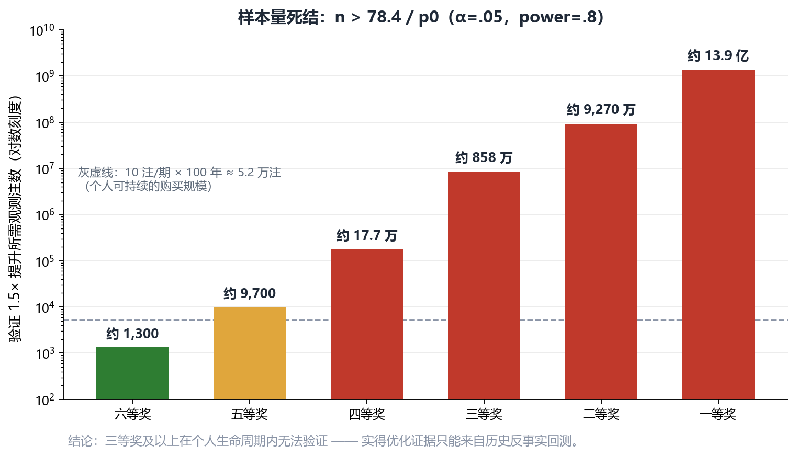
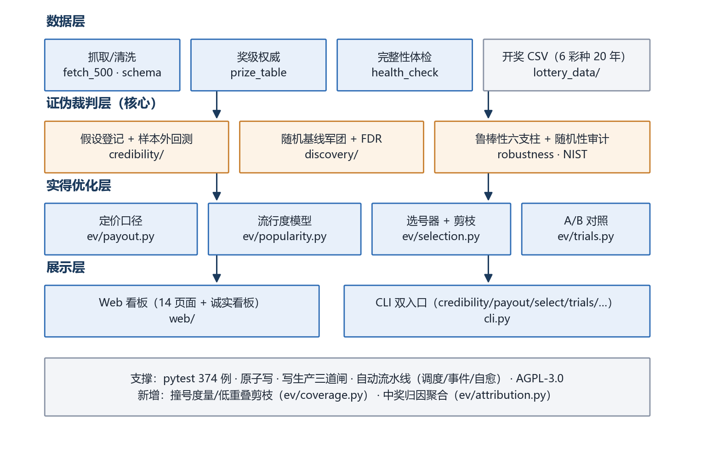
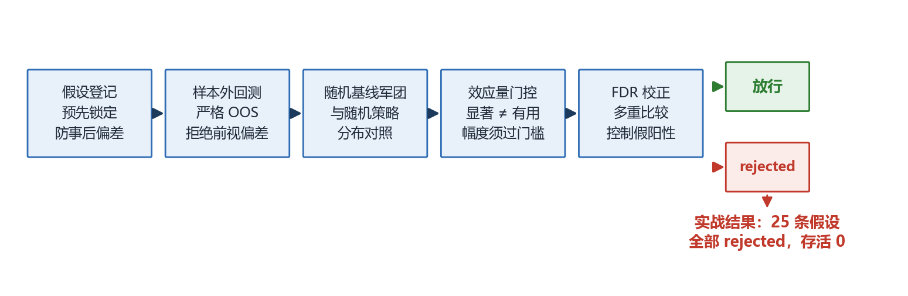
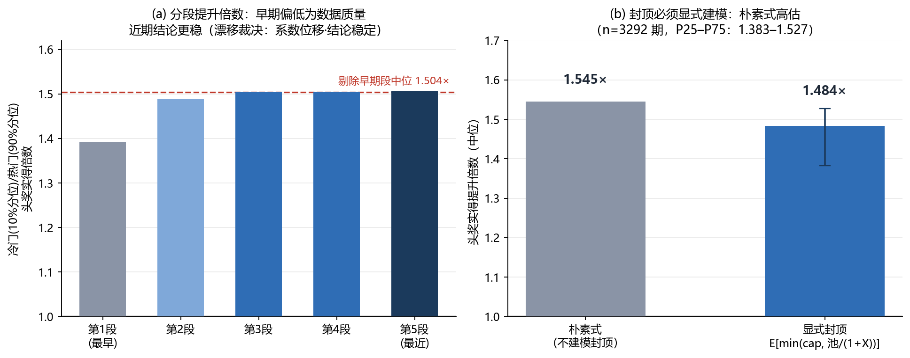

# 时间序列证伪分析框架 —— 结题报告

> **带严格证伪机制的时间序列分析框架（彩票作为示例场景）**
>
> 版本：v1.1 ｜ 日期：2026-09-13 ｜ 许可：AGPL-3.0 ｜ 仓库：<https://github.com/Zalgo1024/lottery-prediction-analyzer>
> 运行环境：Python 3.10 ｜ 测试：pytest 491 例通过 ｜ 数据：6 彩种约 20 年开奖历史

---

## 0. 这是什么？（非技术读者先读这一页）

> **一句话说清：** 这是一个"怎么判断某个预测方法到底有没有用"的项目。我拿彩票开奖数据当试验场，因为它保证不含任何可预测成分。结果：25 个"能提高中奖率"的想法全部被证明不成立；但顺带找到一件真事——在平分奖金的规则下，买冷门号码虽然不能让中奖率变高，却能让中奖后分到的钱平均多约 48%。

**为什么会做这个。** 起点很朴素：想做一个能算彩票号码的程序，希望用更少的注数中更大的奖。做着做着必须先解决一个更基础的问题——怎么判断"一个方法是不是在自欺欺人"。否则任何一次"看着挺灵"都只是巧合。于是项目重心从"找号码"转成了"造一台测谎仪"。

**为什么拿彩票当试验场。** 把项目想成一台测谎仪：要证明它好使，最好的办法不是去测一个诚实的人，而是去测一个"必定在说谎"的对象。彩票就是那个对象——规则完全公开、结果纯随机、没有任何内部信息可作弊。如果一台检测工具能在这种场景里干脆地判出"零信号"，并且说清每一次"好像有信号"是怎么冒出来的（样本内碰巧、假设挑多了、数学近似失效、规则中途改过……），那么把它用到别的真实数据上，才值得信。

**最后交出了三样东西：**

| 交付物 | 一句话说明 |
|---|---|
| 一套"打假"流程 | 任何"我能预测得更准"的说法，都要依次过五道检验：先登记要测什么 → 用没见过的数据回测 → 跟大量随机策略比 → 看效果幅度够不够大 → 校正"试得多了总会撞上"的假阳性。缺一不可。 |
| 一个诚实的结果 | 6 个彩种、25 个具体假设，全部不成立。这里面也包括把我自己最初的目标否掉——这是项目里最贵、也最有价值的一条结论。 |
| 一个可落地的副产品 | 彩票一/二等奖是"中的人平分奖金"。人群偏爱生日号、连号，所以冷门号码中奖时被分走的更少。用 3292 期历史回放测算：冷门组合中奖后的实得约为热门的 **1.484 倍**。注意——这提高的是"中了以后拿多少"，不是"更容易中"。 |

**还有三条边界，写在最前面**（这类项目最容易吹过头）：

1. 中奖概率能否提高，在三等奖以上是**没法验证**的——想证明"中奖率提高 50%"，一等奖需要约 13.9 亿注样本，一个人一辈子也攒不出来。
2. 因此实得结论来自**历史回放测算**而非未来实验，它成立的前提是"大家的选号习惯大致延续"。
3. 单注长期期望仍是亏的（约 −50%），本项目**不承诺赚钱**，只承诺"同样的花销、同样的中奖概率下，中奖时拿得更多一点"。

**怎么读这份报告：** 只想搞懂"这是什么东西" → 本章 + §1 摘要 + 各章开头的「本章在说什么」；想看方法论 → §2~§5；想看工程实现 → §6；想知道哪些话不能说 → §7；术语看不懂 → §8.5 有一张"人话对照表"。

---

## 1. 摘要

> **本章在说什么：** 一页看完：项目做了什么、发现了什么、交付了什么，以及整份报告怎么组织。

本项目构建了一套**以证伪为核心目标**的时间序列分析框架，并选择彩票开奖数据作为检验场景——因为它是"最严苛的测试场"：无协变量、无趋势、大样本、完全随机。任何看似有效的预测策略都会在这里被拆穿。

项目的核心产出不是"预测模型"，而是三个可复现的结论：

1. **证伪结论**：6 彩种共 25 个 edge 假设，经"假设登记 → 严格样本外回测 → 随机基线军团对照 → 效应量门控 → FDR 多重比较校正"五道工序检验后**全部 rejected，存活 0**。彩票开奖不可预测，且本框架能严格证明这一点。
2. **可优化的真实边际**：在公开放弃"提高中奖概率"之后，框架证明唯一可达的优化是**奖金侧**——利用一/二等奖的平分制，冷门组合在中奖时的期望实得是热门组合的 **1.484 倍**（双色球 3292 期反事实回测，封顶显式建模）。
3. **诚实的边界声明**：三等奖以上的概率提升在个人生命周期内**数学上不可验证**（一等奖需约 13.9 亿注观测）；实得奖金层面的前瞻验证期望等待约 1136 年。所有结论的适用范围都在系统输出中显式标注。

工程侧：6 彩种数据管道（抓取/清洗/体检/外部核对）、Web 看板 14 页面 + CLI 双入口、预测-评估闭环、自动流水线（调度/事件/自愈三路触发）、写生产三道闸、491 例单元测试，AGPL-3.0 开源。

---

## 2. 问题与设计哲学

> **本章在说什么：** 最初的诉求怎么被拆成三个能分别下结论的小问题，以及为什么其中一个（提高中奖率）被判定为“做不到”。

### 2.1 需求原点与三拆解

项目最初的需求是"稳定输出高奖金中奖号码，且尽可能少注数"。这个诉求可以被拆成三个**可分别裁决**的子目标：

| 子目标 | 裁决 | 依据 |
|---|---|---|
| ① 提高 P(中奖) | ❌ **不可达** | 项目自身证伪：25 条 edge 假设全 rejected；距离画像观测中位 6.0 = 随机基线 6.0 |
| ② 提高 E(中奖后实得) | ✅ **可达** | 一/二等奖为平分制，冷门组合独享奖金池 → 实得可差数倍 |
| ③ 减少注数 | ✅ **可达** | 与 ② 相容（② 不依赖广覆盖） |

**结论：框架只追 ② + ③，公开放弃 ①。** 这个裁决过程本身是项目最重要的设计决策——先证明什么不可达，再在可达范围内做工程化。

### 2.2 为什么 ① 不可达：样本量算术

要证明某选号策略把某奖级命中率提升到 1.5 倍，所需观测注数 `n > 78.4 / p₀`（α=.05、power=.8、泊松两样本近似）：

| 奖级（双色球） | 理论概率 | 所需注数 | 折算（10 注/期） |
|---|---|---|---|
| 六等奖 | 1/17 | 约 1,300 | 几期 ✅ |
| 五等奖 | 1/124 | 约 9,700 | ≈6.5 年 ⚠️ |
| 四等奖 | 1/2255 | 约 17.7 万 | ≈118 年 ❌ |
| 三等奖 | 1/109,389 | 约 858 万 | ❌ |
| 二等奖 | 1/1,181,406 | 约 9,270 万 | ❌ |
| 一等奖 | 1/17,721,088 | 约 13.9 亿 | ❌ |



叠加期望值算术（每注 2 元）：固定奖期望回收约 0.49 元 + 浮动奖约 0.51 元 ≈ 1.0 元，**长期期望 −50%**。即使固定奖命中率提升到 3 倍：3×0.49 + 0.51 = 1.98 < 2，**仍打不平**。

### 2.3 设计哲学：先证伪，再建设

1. **不声称提高中奖概率**。各奖级概率一律使用组合精确概率，模型不触碰概率侧；分数差异只能来自奖金侧——这在数学上杜绝了"声称更准"的可能。
2. **可证伪优先**。每个工作包预设 Go/No-Go 门槛，不显著即公开宣布此路不通。失败的假设是合格产出，被大乐透流行度模型的公开否决实录所证明（见 §5.1）。
3. **用历史反事实回测绕开样本量死结**。一等奖的未来数据永远不够，但"历史每期实际开出的号码 × 当期实际一等奖注数"的反事实计算**现在就能做**（见 §5.2）。

---

## 3. 系统架构

> **本章在说什么：** 整套系统由哪四层组成、各层负责什么，为什么一台普通电脑就能跑。



框架分为四层，全部模块无外部服务依赖，单机可运行：

| 层 | 模块 | 职责 |
|---|---|---|
| **数据层** | `data/`（fetch_500 · schema · prize_table · feedback）、`lottery_data/` | 6 彩种开奖数据抓取、清洗、分区归一化、奖级→单注奖金权威映射、完整性体检与外部逐期核对 |
| **证伪裁判层** | `credibility/`（假设登记·样本外回测·基线·贝叶斯·变点·随机性审计·鲁棒性六支柱）、`discovery/`（随机基线军团·FDR·e-value） | 一切"有效信号"声称的唯一裁决通道 |
| **实得优化层** | `ev/`（payout · popularity · selection · trials · rulebook · crowd_model · rollover · kelly） | 奖金侧定价、流行度建模、实得选号、前瞻 A/B 对照 |
| **展示层** | `web/`（14 页面看板 + 自动流水线 worker）、`cli.py`（约 20 个子命令） | 统计/训练/预测/命中历史（每条记录标注**第 X 批 · 第 Y 注**）/EV/诚实看板；CLI 与 Web 共享同一实现 |

支撑设施：共享 JSON 原子写（tmp+fsync+os.replace）、写生产三道闸（见 §6）、三路触发的自动流水线（调度/事件/自愈）、git bundle + 数据 zip 双备份。

---

## 4. 证伪流水线（技术核心 ①）

> **本章在说什么：** 怎么用五道工序判断“这方法真有用还是碰巧”；实战结果是 25 个假设全部不成立。



### 4.1 五道工序

任何策略想声称"有 edge"，必须依次通过：

1. **假设登记**：假设在检验前预登记（`training/hypotheses/`），包含名称、彩种、检验口径，杜绝事后挑选。
2. **严格样本外回测**：滚动时间序切分，拒绝前视偏差；训练/评估窗口不重叠。
3. **随机基线军团对照**：策略收益分布与大量随机策略的零分布对照——大样本下用蒙特卡洛零分布替代渐近 χ²（防止渐近近似失效制造假阳性）。
4. **效应量门控**：p 显著 ≠ 有用，效应幅度必须超过预设门槛。
5. **FDR 多重比较校正**：同时检验多条假设时控制错误发现率。

### 4.2 实战结果：25 条假设，存活 0

| 彩种 | 登记假设 | 结果 |
|---|---|---|
| 双色球 | 高频 / 遗漏值 / 区间均衡策略 OOS 优于随机 | 3/3 rejected |
| 大乐透 | 高频 / 遗漏值 / 区间均衡策略 OOS 优于随机 | 3/3 rejected |
| 排列3 | 高频 / 遗漏值 / 区间均衡 / 冷门号限号 EV 持续高于热门 | 4/4 rejected |
| 排列5 | 高频 / 遗漏值 / 区间均衡 / 冷门号限号 EV 持续高于热门 | 4/4 rejected |
| 福彩3D | 高频 / 遗漏值 / 区间均衡 / 冷门号限号 EV 持续高于热门 | 4/4 rejected |
| 七星彩 | 高频 / 遗漏值 / 区间均衡 / ML 策略 / 限号后冷门 EV / 浮动头奖撞号分薄 / 节假日窗口效应 | 7/7 rejected |
| **合计** | | **25/25 rejected，存活 0** |

**并行证据链**：e-value 序贯检验对 6 彩种 22 个监控分区做"任意停时有效"的持续监控（拒绝阈 440），全部区域 e-max 远低于阈值、零告警——"开奖序列公平随机"通过持续监控，与闸门结论一致。

**方法论防坑记录**（实现中真实踩过并修复的）：

- 分区规则变更（七星彩第 7 位 0-9 → 0-14）后，按位检验必须**分段**——否则规则变更会被误检为 p≈1e-10 的"异常"。
- 大样本下检验零分布必须用蒙特卡洛，渐近 χ² 会失效。

### 4.3 这个"负结果"为什么有价值

彩票场景的价值在于：它是对时序预测方法**最严苛的对抗性测试**。一个能在此场景严格给出"零信号"裁决、且能解释每一类假阳性来源（前视偏差、多重比较、渐近近似、规则变更断面）的框架，迁移到任何真实时序场景时，同样能给出可信的"信号存在/不存在"裁决。**框架的灵敏度由它抓住假阳性的能力来证明。**

---

## 5. 实得优化轨道（技术核心 ②）

> **本章在说什么：** 既然中奖率动不了，钱还能从哪里多拿——平分制奖池下的“冷门效应”，以及怎么证明它是真的。

概率侧被证伪后，奖金侧仍有真实的数学结构：一/二等奖按注**平分**当期奖池，而人群选号并非均匀——生日号、连号、规律组合被系统性超买。买冷门组合不改变中奖概率，但**中奖时独享奖池的概率更高**。

### 5.1 组合流行度模型：双色球 GO，大乐透 NO-GO

**建模**：9 维组合特征（生日月/日占比、连号长度、跨度、和值偏离、奇偶比、尾数重复、半区偏斜、上期重合数）+ Poisson 回归拟合 `一等奖注数 ~ f(特征) + offset(log(销量))`，样本为全部历史期。

**Go/No-Go 门槛**：LRT p<0.01 **且** 时序 5 折交叉验证多数折优于零模型。两道门槛缺一不可：

| 彩种 | n | 样本内 LRT | 样本外 CV | 裁决 |
|---|---|---|---|---|
| 双色球 | 3502 | χ²=948.85, df=9, **p=1.84e-198** | **5/5 折**优于零模型 | **GO** |
| 大乐透 | 2921 | χ²=337, df=9, p=3.7e-67（显著） | **仅 1/5 折** | **NO-GO：公开否决** |

**这一对结果的价值在于对照**：大乐透样本内极其显著，但样本外不稳健——CV 门槛成功拦截了一个假阳性。这是"样本内显著 ≠ 样本外可用"的现成实证案例，也是 Go/No-Go 机制真实发挥作用的证明。

工程细节：模型参数+全组合打分落盘三级缓存（进程内 → 磁盘 → 现算，参数指纹+样本数校验自动过期），端点首载 4610ms → 187ms。

### 5.2 反事实回测：冷门组合实得 1.484×

**方法**（绕开一等奖样本量死结的关键设计）：对历史每期，取当期**实际开奖号**的流行度分位，对照当期**实际**一等奖注数与可分配池，计算"若持有冷门（10% 分位）vs 热门（90% 分位）组合，中奖时单注实得多少"。

**封顶显式建模**是本回测的方法论要点：实得期望 = `E[min(cap, 池/(1+X))]`，X~Poisson(μ)。朴素式（池×E[1/(1+X)]，不建模 1000 万封顶）得 1.545×，**高估**了冷门优势——奖池巨厚时几乎所有分配情形被封顶截断，冷门优势被压缩。



**结果**（双色球 n=3292 期）：冷门组合头奖实得提升倍数中位 **1.484×**（P25–P75：1.383–1.527）；剔除早期数据质量偏低的分段后中位 **1.504×**。

**漂移监控**（drift_report，三档裁决：稳定 / 系数位移·结论仍稳定 / 漂移告警）：双色球 3502 期按时间序 5 段的分段提升为 1.393 → 1.488 → 1.504 → 1.505 → 1.507×，β 前后半段联合卡方显著（χ²=153.4）但校准比 0.951（总量未漂移）→ 裁决"**系数位移（结论仍稳定）**"：早期段偏低源于早期销量/数据质量，近期结论反而更稳。漂移监控的性质被显式声明为**维护**（保证结论不过时），不会凭空提高提升倍数。

### 5.3 选号器与前瞻 A/B 对照

**选号器**（`ev/selection.py`）：候选池（默认 2 万合法注）→ 一等奖实得降序 → 低重叠贪心。分数差异 100% 来自奖金侧（概率项对所有候选相同）。批量打分向量化后 37.4s → 1.71s。大乐透因 NO-GO **跳过打分直接随机**并如实标注——拒绝输出伪排序。

**前瞻 A/B 对照**（`ev/trials.py`，持续运行中）：每期同时生成 A=模型选号 / B=同候选池随机对照（同低重叠约束），唯一差异 = 是否按实得排序。期号口径严格分离：记录「期号」=下注目标期，另存「打分基准期」——两者混用即构成虚假对照（docstring + 单测锁定）。

**两个终点的诚实划分**：

| 终点 | 可完成性 | 时间尺度 |
|---|---|---|
| 中奖率等价性（主终点，安慰剂检验） | ✅ 可完成 | 60 期 ≈ 5 个月（检出 20% 差异）；229 期 ≈ 1.5 年（10%） |
| 实得奖金差异（次终点） | ❌ 不可完成 | 头奖期望等待约 **1136 年** |

主终点的价值是**等价性检验**：理论预期 A/B 中奖率完全相等（概率与号码无关的契约），若出现显著差异 = 实现存在 bug。统计工具：配对符号检验 + 序贯 e-value（任意停时有效）+ TOST 等价检验。

### 5.4 天花板声明

本轨道交付的是"**中奖时实得更高**"，不是"更常中"。单注期望仍为负（约 −1.0 → −0.6）；能翻正的唯一窗口是派奖活动/异常奖池，而那需要广覆盖，与"少注数"本质冲突。**这一声明在系统所有对外输出（看板/CLI/报告）中原样呈现，不做模糊处理。**

---

## 6. 工程与可靠性

> **本章在说什么：** 数据凭什么可信、改代码凭什么不闯祸、系统凭什么一直能跑。

### 6.1 数据质量体系

- **体检总入口**（`scripts/health_check.py`，只读）：一次性跑 6 类检查（完整性/记录审计/pending 新鲜度/关键字段/流水线快照/写保护自检）→ 结构化报告。最近一次结论：**真实待处理问题 0 项**。
- **外部核对**：开奖数据与独立源逐期核对（`verify_draws_vs_source`）；唯一已知数据缺口 = 排列5 两期（2004 年，数据源本身缺失），已在体检中显式豁免登记。
- **修复工具**（`scripts/repair_records.py`）：默认 dry-run，`--apply` 前自动备份；历史修复过三类真实问题（分区名迁移静默清零、非法票误判奖级、命中/奖级不符）。

### 6.2 写生产三道闸

预测/训练闭环会写生产数据，项目为此建立了三层防护（起因是一次测试运行把生产 100 组待评估预测覆盖成 3 组）：

1. pytest 进程内拒写生产 feedback 目录（环境变量显式放行才可写）；
2. 预测接口支持 `record_pending=False` 显式只算不落库；
3. 训练闭环遇同期已有生产预测时跳过写入。

### 6.2.1 出号数量：固定 / 动态（2026-09-14）

在看板「自动化运行状态」卡下方提供**出号数量**控件，用户可直接用滑轨设定每个彩种每期出几注，分两种模式：

- **固定数量**：每次出号恒等于设定值（上下限：数字型 1–50，乐透型 1–200）。
- **动态数量**：系统随每期评估自适应——以「上批质量/重叠压缩的冗余淘汰占比」为主信号，
  冗余高（≥50%）且命中率贴近理论期望（edge 稳定）时逐步走低；命中率显著偏离理论值
  （|z|>2 个标准误）时回补，避免把注数压得过低而失去统计功效。硬下限 1 注。

配置持久化于 `config/ticket_size.json`（原子写），经 `config.resolve_groups` 统一下发，
自动流水线、内置调度器、worker、启动恢复、CLI 与 Windows 计划任务六条路径全部生效；
`cli.py predict --groups N` 的显式参数仍可临时绕过。动态调整的每次理由写入 `policy` 字段，
看板与 `GET /api/settings/ticket-size` 可查。

**诚实边界**：改注数只改变下注规模与成本，单注中奖概率恒定（期望线性性），整体 EV 仍为负；
"动态下调"不是预测能力提升，只是省钱与冗余控制。

### 6.2.2 消息推送：手机随时查看出号与中奖记录（2026-09-16；企业微信 09-17；图片推送 09-18）

**每个自动化 / 自检入口跑完都会推一次**，内容以**图片**为主：

1. **每个彩种一张「号码图」** —— 本期出号**全部注数**（超 40 注自动分列，不截断）＋ 目标期号与滑轨状态；
2. **每个彩种一张「中奖图」** —— 表格形式列出命中：期号 ｜ 号码 ｜ 命中球数 ｜ 奖级；
3. 每张图前各附**一行短文字**（彩种 · 期号 · 注数），并带上「最新开奖号码」行；
4. 渲染或发送失败时**自动降级为文字消息**（受 4096 字节限制，最多展示 60 注）。

用图片的原因：企业微信群机器人 markdown 单条上限 **4096 字节**（中文 3 字节/字），
双色球 / 大乐透一次上百注必然被截断、末尾的诚实声明也会被砍掉；图片没有这个限制。

**触发时机**：六条并行入口全部覆盖——内置调度器（每晚 22:05，按开奖日触发 + 21:00–23:00 滞后补跑）、
worker 事件驱动、启动恢复、Web 手动/批量、**Windows 计划任务（`cli.py auto` 路径）**，
另加两处自检推送（`scripts/health_check.py` 项目体检、`web/startup_recovery.py` 启动自检）。
结算段落只在当期确有新命中时才出现，而新命中只在开奖后才有——**夜间推送自然带中奖图、白天只推号码图**
（数据驱动，不依赖钟点判断，因此无需给调度器传时间参数）。

渠道三选一，在看板「微信推送」卡配置：

- **企业微信群机器人**（推荐）：手机装企业微信 → 建一个只有自己的群 → 群设置 → 群机器人 → 添加 →
  复制 Webhook 地址粘进看板，**免费且不限条数，且只有它支持图片消息**；完整 Webhook 地址或
  `?key=` 后的裸串都能识别。群机器人无独立标题字段、markdown 也不渲染 `-` 列表，由 `_wecom_render`
  做适配（标题并入首行、无序项转 `·`）并按 4096 字节安全截断；**图片消息同样没有 caption**，
  故彩种名、期号、注数与诚实声明都画进图里（中文字体缺 emoji 字形，渲染前统一剔除）。
- **PushPlus** / **Server酱**（免费 5 条/天）：推到个人微信；不支持图片，自动降级为文字。

安全与可靠性：token 回显一律掩码、掩码回传不覆盖真实值；**发送节流**（企微每个机器人 20 条/分钟，
默认相邻间隔 3.2 秒）避免一个开奖夜十余条消息被限速丢弃；**每日上限默认 0 = 不限制**
（可设为 >0 重新启用保护）；`conftest.py` 夹具把配置存储重定向到临时目录，保证测试永不写坏真身配置；
未配置或网络异常一律降级为日志告警，**绝不阻塞主流水线**。
**边界说明**：企业微信群机器人只能单向推送，无法在群里反向下发指令，故"调出号数量"仍在看板完成——
可填「看板地址」（如 Tailscale 内网地址），推送末尾会附一条直达链接。

**诚实边界**：推送只是通知渠道，不改变任何概率与 EV 结论；推荐内容同样仅供研究记录。

### 6.3 测试与运维

- **pytest 491 例**全量通过，覆盖奖金口径（固定/浮动/分薄/封顶）、批量与单注口径对齐、期号口径、写保护回归、NO-GO 诚实路径、撞号度量与低重叠剪枝、中奖归因聚合、**出号批次标注（第 X 批 · 第 Y 注）**、出号数量固定/动态滑轨、**消息推送（图片渲染/图片发送/发送节流/降级回退/全入口接线/彩种规范名）**等。
- 改代码后经看门狗热重启（健康检查复用旧进程的坑已修），共享 JSON 一律原子写。
- 源滞后防线：开奖当晚「只有号码、奖金列未回填」的最新一期会被期号解析自动跳过（否则浮动奖级读不到当期奖金 → EV 系统性低估）。
- 备份：git bundle 全量 + 数据 zip，改数据前强制留原始副本。

### 6.4 开源与许可

项目以 **AGPL-3.0** 许可开源（2026-09-12 起仓库含完整 LICENSE 与 README 许可章节）。开奖数据与运行数据不随代码许可分发。

---

## 7. 局限与展望

> **本章在说什么：** 哪些结论我明确不敢说、哪些还要等时间才能说。

**已知局限（诚实声明）**：

1. 概率侧提升的验证在三等奖以上数学上不可行（样本量死结），该结论不可绕过，只能绕开（反事实回测）。
2. 实得奖金层面的前瞻验证期望等待 1136 年——实得证据只能来自历史反事实回测，其外推假设是"人群选号行为结构延续"。
3. 流行度模型仅双色球通过 OOS 门槛；大乐透的否决说明该结构不可跨彩种想当然迁移。
4. A/B 前瞻对照刚开始积累（目标 60 期），目前只证明"框架能跑"，不构成任何结论。
5. 数据来源为第三方聚合站（500.com），已做外部核对但源头错漏仍可能传导。

**展望**：

- A/B 对照跑满 60 期后输出首份等价性裁决；
- 漂移监控按季度重拟合（流水线自动），维持 1.484× 结论的时效性;
- 证伪流水线抽象为通用时序信号检验组件（脱离彩票场景复用）。

---

## 8. 附录

> **本章在说什么：** 技术栈、常用命令、配图清单、每个数字的出处，以及术语的“人话翻译”。

### 8.1 技术栈

Python 3.10 · numpy / pandas / statsmodels（Poisson GLM）/ lightgbm · Flask（14 页面看板）· matplotlib（含推送图片渲染）· pytest（491 例）· GitHub API 备份流。

### 8.2 关键命令

```bash
python cli.py credibility            # 证伪闸门总览
python cli.py payout 双色球 --red 1,2,3,4,5,6 --blue 7   # 单注实得分解
python cli.py select 双色球 --groups 5                   # 实得选号（低重叠剪枝）
python cli.py drift 双色球           # 流行度漂移报告
python cli.py trials 双色球 --report # A/B 对照进度
python ev/coverage.py                # 各彩种撞号基线与重叠上限（只读）
python scripts/health_check.py       # 项目体检（只读）
pytest -q                             # 491 passed（全量）
pytest tests/                         # 482 passed（仅 tests/；另有 9 例在 scripts/ 下）
```

### 8.3 报告配图清单

| 文件 | 内容 |
|---|---|
| `assets/fig_architecture.png` | 四层系统架构 |
| `assets/fig_pipeline.png` | 证伪流水线五道工序 |
| `assets/fig_sample_size.png` | 样本量死结（对数刻度） |
| `assets/fig_backtest.png` | 分段提升倍数 + 封顶建模对比 |

### 8.5 术语对照表（人话版）

| 报告里的术语 | 原本的意思 | 换成大白话 |
|---|---|---|
| edge | 某方法相对随机存在额外优势、可预测性 | 就是“这招真的比瞎猜准” |
| 假设登记 | 检验前先把要测的说法写下来 | 先立字据再开测，防“事后诸葛亮” |
| 样本外回测（OOS） | 只用没参与建模的那段历史去检验 | 考试前不许看答案 |
| 前视偏差 | 不小心用了当时还不知道的信息 | 拿明天的报纸做今天的决定 |
| p 值 | 纯随机情况下出现这种结果的可能性 | “纯属巧合”的概率，越小越不像巧合 |
| 效应量 | 好多少、幅度有多大 | 不只看“有没有差别”，还要看“差多少” |
| FDR 校正 | 控制“试很多次必然撞上几次假阳性”的错误率 | 考 100 次试总有几次蒙对，要按次数折价 |
| 随机基线军团 | 造一大批随机策略一起对照 | 找一堆“瞎猜选手”当陪练 |
| e-value 序贯检验 | 可以随时看、随时停的持续监控指标 | 仪表一直亮着灯，什么时候读都安全 |
| Poisson GLM／流行度模型 | 用统计模型估计某个号码组合有多少人买 | 预测哪些号码“买的人多” |
| 平分制 | 一/二等奖由中奖者平分当期奖池 | 中的人一起分这锅饭 |
| 撞号分薄 | 同一注号码买的人多，奖金被摊薄 | 一锅饭抢的人多，每人分得少 |
| 封顶 | 单注头奖有上限（如 1000 万） | 池子再大，一注最多也只给这么多 |
| 反事实回测 | 拿历史真实开奖回放：当时买冷门号会拿多少 | 用历史录像做“如果当初”的推演 |
| Go / No-Go 门槛 | 事先定好达到什么标准才继续做 | 先说清“什么算成功”，达不到就认输 |
| 漂移监控 | 盯住模型系数是否随时间变化 | 定期体检，防止老结论过期 |

> 注：本表只做通俗解释，精确定义以正文与代码为准。

### 8.4 数字溯源

本报告全部数字取自项目真实输出：假设登记与裁决（`training/hypotheses/`、`discovery/evalues.json`）、流行度模型（`cache/popularity_model_双色球.json`：n=3502、χ²=948.85、p=1.84e-198、CV 5/5）、反事实回测与漂移分段（`ev/popularity` 输出）、体检（`logs/项目体检_20260911.md`）、测试统计（pytest 全量运行）。
